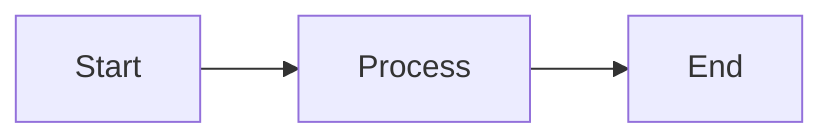

# Scientific Project Manager Documentation

This directory contains the complete documentation for the Scientific Project Manager Odoo addon, built with [MkDocs](https://www.mkdocs.org/) and the [Material theme](https://squidfunk.github.io/mkdocs-material/).

## 📚 Documentation Structure

```
docs/
├── Dockerfile              # Docker image for documentation server
├── docker-compose.yml      # Docker Compose configuration
├── requirements.txt        # Python dependencies
├── mkdocs.yml             # MkDocs configuration
├── README.md              # This file
└── docs/                  # Documentation content
    ├── index.md           # Homepage
    ├── getting-started/   # Installation and setup guides
    ├── user-guide/        # User documentation
    ├── api-reference/     # Technical API documentation
    ├── security/          # Security configuration
    ├── developer-guide/   # Developer documentation
    ├── examples/          # Code examples and use cases
    └── assets/            # Images, diagrams, etc.
```

## 🚀 Quick Start

### Option 1: Using Docker (Recommended)

The easiest way to view and develop the documentation:

```bash
# Navigate to docs directory
cd docs/

# Start the documentation server
docker-compose up -d

# View documentation at http://localhost:8000
```

The server includes live reload - any changes to documentation files will automatically refresh the browser.

### Option 2: Local Installation

If you prefer to run without Docker:

```bash
# Install dependencies
pip install -r requirements.txt

# Serve documentation
mkdocs serve

# Access at http://localhost:8000
```

## 🛠️ Development

### Making Changes

1. Edit markdown files in `docs/` directory
2. Changes are automatically reflected (live reload)
3. Test locally before committing

### Adding New Pages

1. Create markdown file in appropriate directory:
   ```bash
   touch docs/user-guide/new-feature.md
   ```

2. Add to navigation in `mkdocs.yml`:
   ```yaml
   nav:
     - User Guide:
       - New Feature: user-guide/new-feature.md
   ```

3. Write content using markdown

### Using Features

#### Admonitions (Callout Boxes)

```markdown
!!! note "Optional Title"
    This is a note with an optional custom title.

!!! tip
    This is a tip.

!!! warning
    This is a warning.

!!! danger
    This is a danger message.
```

#### Code Blocks with Syntax Highlighting

````markdown
```python
def example_function():
    return "Hello, World!"
```

```bash
docker-compose up -d
```
````

#### Tabs

```markdown
=== "Tab 1"
    Content for tab 1

=== "Tab 2"
    Content for tab 2
```

#### Mermaid Diagrams

````markdown

````

#### Task Lists

```markdown
- [x] Completed task
- [ ] Incomplete task
```

## 📦 Building for Production

### Build Static Site

```bash
# Build static HTML files
mkdocs build

# Output is in site/ directory
ls site/
```

### Deploy to GitHub Pages

```bash
# Deploy to gh-pages branch
mkdocs gh-deploy
```

### Build Docker Image

```bash
# Build the image
docker build -t scientific-project-docs:latest .

# Run the container
docker run -d -p 8000:8000 scientific-project-docs:latest
```

### Production Deployment

For production, use a web server like Nginx:

```bash
# Build static files
mkdocs build

# Copy to web server
rsync -av site/ user@server:/var/www/docs/

# Or use Docker with Nginx
docker-compose -f docker-compose.prod.yml up -d
```

## 🎨 Customization

### Theme Configuration

Edit `mkdocs.yml` to customize:

- **Colors**: Change `palette` section
- **Fonts**: Modify `font` section
- **Logo**: Add logo image and update `theme.logo`
- **Features**: Enable/disable navigation features

### Custom CSS

Add custom styles:

1. Create `docs/stylesheets/extra.css`
2. Add to `mkdocs.yml`:
   ```yaml
   extra_css:
     - stylesheets/extra.css
   ```

### Custom JavaScript

Add custom scripts:

1. Create `docs/javascripts/extra.js`
2. Add to `mkdocs.yml`:
   ```yaml
   extra_javascript:
     - javascripts/extra.js
   ```

## 🔍 Search Functionality

The documentation includes full-text search powered by MkDocs' built-in search plugin:

- Search bar in navigation
- Keyboard shortcut: Press `/` or `S`
- Results highlight matching terms
- Works offline after first load

## 📱 Responsive Design

The Material theme is fully responsive:

- Mobile-friendly navigation
- Touch-optimized interface
- Adaptive layout
- Progressive Web App (PWA) support

## 🌐 Multi-Language Support

To add multiple languages:

1. Install i18n plugin:
   ```bash
   pip install mkdocs-static-i18n
   ```

2. Update `mkdocs.yml`:
   ```yaml
   plugins:
     - i18n:
         languages:
           en: English
           es: Español
   ```

3. Create language-specific files:
   ```
   docs/index.md      # English
   docs/index.es.md   # Spanish
   ```

## 🧪 Testing

### Check for Broken Links

```bash
# Install plugin
pip install mkdocs-linkcheck

# Add to mkdocs.yml
plugins:
  - linkcheck

# Run build (will check links)
mkdocs build
```

### Validate Markdown

```bash
# Install markdownlint
npm install -g markdownlint-cli

# Check markdown files
markdownlint docs/**/*.md
```

### Spell Check

```bash
# Install aspell
apt-get install aspell aspell-en

# Check spelling
aspell check docs/index.md
```

## 📊 Analytics

The documentation can integrate with analytics services:

### Google Analytics

In `mkdocs.yml`:

```yaml
extra:
  analytics:
    provider: google
    property: G-XXXXXXXXXX
```

### Plausible Analytics

```yaml
extra:
  analytics:
    provider: plausible
    domain: your-domain.com
```

## 🔒 Security

### For Public Documentation

- Enable HTTPS (use nginx with SSL)
- Configure CORS if needed
- Set security headers
- Use CDN for static assets

### For Private Documentation

- Add authentication (Basic Auth, OAuth)
- Restrict by IP
- Use VPN
- Deploy behind firewall

## 🐛 Troubleshooting

### Port Already in Use

```bash
# Change port in docker-compose.yml
ports:
  - "8001:8000"  # Use 8001 instead

# Or stop conflicting service
lsof -ti:8000 | xargs kill
```

### Live Reload Not Working

```bash
# Ensure volumes are mounted correctly
docker-compose down
docker-compose up -d

# Check container logs
docker-compose logs docs
```

### Build Fails

```bash
# Clear cache
mkdocs build --clean

# Check for syntax errors
python -m mkdocs build --verbose
```

### Missing Dependencies

```bash
# Reinstall requirements
pip install --force-reinstall -r requirements.txt
```

## 📝 Contributing

### Documentation Guidelines

1. **Use clear, concise language**
2. **Include code examples**
3. **Add screenshots where helpful**
4. **Test all commands and code**
5. **Follow markdown style guide**

### Markdown Style

- Use ATX-style headers (`#` not underlines)
- Add blank line before and after lists
- Use fenced code blocks with language
- Limit lines to 100 characters
- Use relative links for internal pages

### Commit Messages

```
docs: add installation guide
docs: update API reference for project model
docs: fix typo in quick start
docs: add security best practices
```

## 🔄 Continuous Integration

### GitHub Actions

Create `.github/workflows/docs.yml`:

```yaml
name: Deploy Documentation

on:
  push:
    branches: [main]

jobs:
  deploy:
    runs-on: ubuntu-latest
    steps:
      - uses: actions/checkout@v3
      - uses: actions/setup-python@v4
        with:
          python-version: 3.x
      - run: pip install -r docs/requirements.txt
      - run: mkdocs gh-deploy --force
```

## 📚 Resources

### MkDocs

- [MkDocs Documentation](https://www.mkdocs.org/)
- [Material Theme Docs](https://squidfunk.github.io/mkdocs-material/)
- [Markdown Guide](https://www.markdownguide.org/)

### Extensions

- [PyMdown Extensions](https://facelessuser.github.io/pymdown-extensions/)
- [MkDocs Plugins](https://github.com/mkdocs/catalog)

### Tools

- [Mermaid Diagrams](https://mermaid.js.org/)
- [PlantUML](https://plantuml.com/)
- [Draw.io](https://app.diagrams.net/)

## 📞 Support

- **Issues**: [GitHub Issues](https://github.com/steven0seagal/odoo_scientific_project/issues)
- **Discussions**: [GitHub Discussions](https://github.com/steven0seagal/odoo_scientific_project/discussions)
- **Email**: support@example.com

## 📄 License

Documentation is licensed under CC BY 4.0.

Code examples in documentation are licensed under LGPL-3.

---

**Happy Documenting!** 📖✨
