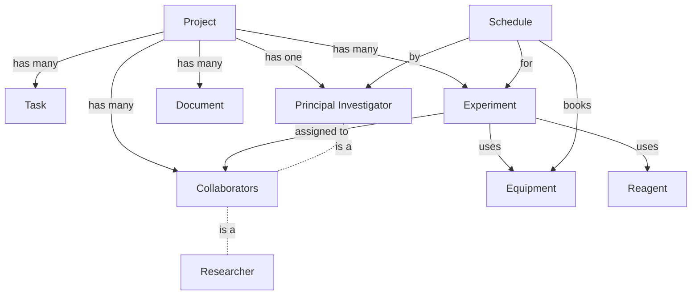

# API Reference Overview

Welcome to the Scientific Project Manager API reference. This section provides complete technical documentation for all models, fields, and methods.

## Quick Access

<div class="grid cards" markdown>

-   :material-database:{ .lg .middle } __Core Models__

    ---

    Project, Task, Experiment, and Researcher models

    [:octicons-arrow-right-24: View Core Models](core-models/project.md)

-   :material-file-tree:{ .lg .middle } __Supporting Models__

    ---

    Document, Equipment, Reagent, Schedule, and Tags

    [:octicons-arrow-right-24: View Supporting Models](supporting-models/document.md)

-   :material-application-variable:{ .lg .middle } __Data Models__

    ---

    Funding, Publication, Data Management, and Partner

    [:octicons-arrow-right-24: View Data Models](data-models/funding.md)

-   :material-code-braces:{ .lg .middle } __Methods & Integration__

    ---

    API methods and integration points

    [:octicons-arrow-right-24: View Methods](methods.md)

</div>

## Module Information

| Attribute | Value |
|-----------|-------|
| **Module Name** | `scientific_project` |
| **Technical Name** | `scientific_project` |
| **Version** | 15.0.1.0.0 |
| **Category** | Project |
| **Dependencies** | `base`, `mail` |
| **License** | LGPL-3 |

## Model Overview

The module defines **13 models** organized in three categories:

### Core Models (4)

| Model | Description | Location |
|-------|-------------|----------|
| `scientific.project` | Main project management | [Documentation](core-models/project.md) |
| `scientific.task` | Task management | [Documentation](core-models/task.md) |
| `scientific.experiment` | Experiment tracking | [Documentation](core-models/experiment.md) |
| `scientific.researcher` | Researcher profiles | [Documentation](core-models/researcher.md) |

### Supporting Models (5)

| Model | Description | Location |
|-------|-------------|----------|
| `scientific.document` | Document management | [Documentation](supporting-models/document.md) |
| `scientific.equipment` | Equipment tracking | [Documentation](supporting-models/equipment.md) |
| `scientific.reagent` | Reagent inventory | [Documentation](supporting-models/reagent.md) |
| `scientific.schedule` | Resource scheduling | [Documentation](supporting-models/schedule.md) |
| `scientific.tags` | Researcher tags | [Documentation](supporting-models/tags.md) |

### Data Models (4)

| Model | Description | Location |
|-------|-------------|----------|
| `scientific.funding` | Funding sources | [Documentation](data-models/funding.md) |
| `scientific.publication` | Publications | [Documentation](data-models/publication.md) |
| `scientific.data_management` | Data management | [Documentation](data-models/data-management.md) |
| `scientific.partner` | External partners | [Documentation](data-models/partner.md) |

## Field Types

For detailed information about field types, see [Field Types Reference](field-types.md).

Common field types used:

| Type | Usage | Example |
|------|-------|---------|
| `Char` | Short text | Names, titles |
| `Text` | Long text | Descriptions, notes |
| `Date` | Dates | Start/end dates |
| `Datetime` | Date with time | Scheduling |
| `Selection` | Dropdown | Status fields |
| `Many2one` | Foreign key | Project → PI |
| `Many2many` | Many-to-many | Projects ↔ Collaborators |

## API Access

### Python ORM

```python
# Access from within Odoo
env = self.env

# Search records
projects = env['scientific.project'].search([
    ('status', '=', 'in_progress')
])

# Create record
project = env['scientific.project'].create({
    'name': 'New Project',
    'status': 'draft',
})

# Update record
project.write({'status': 'in_progress'})

# Delete record
project.unlink()
```

### XML-RPC API

```python
import xmlrpc.client

# Connection
url = 'http://localhost:8069'
db = 'database'
username = 'admin'
password = 'admin'

common = xmlrpc.client.ServerProxy(f'{url}/xmlrpc/2/common')
uid = common.authenticate(db, username, password, {})

models = xmlrpc.client.ServerProxy(f'{url}/xmlrpc/2/object')

# Search
project_ids = models.execute_kw(
    db, uid, password,
    'scientific.project', 'search',
    [[['status', '=', 'in_progress']]]
)

# Read
projects = models.execute_kw(
    db, uid, password,
    'scientific.project', 'read',
    [project_ids],
    {'fields': ['name', 'status']}
)
```

### JSON-RPC API

```python
import requests
import json

url = 'http://localhost:8069/jsonrpc'
headers = {'Content-Type': 'application/json'}

# Authenticate
auth_data = {
    'jsonrpc': '2.0',
    'method': 'call',
    'params': {
        'service': 'common',
        'method': 'authenticate',
        'args': [db, username, password, {}]
    },
    'id': 1
}

response = requests.post(url, json=auth_data, headers=headers)
uid = response.json()['result']

# Search and read
search_data = {
    'jsonrpc': '2.0',
    'method': 'call',
    'params': {
        'service': 'object',
        'method': 'execute_kw',
        'args': [
            db, uid, password,
            'scientific.project', 'search_read',
            [[['status', '=', 'in_progress']]],
            {'fields': ['name', 'status']}
        ]
    },
    'id': 2
}

response = requests.post(url, json=search_data, headers=headers)
projects = response.json()['result']
```

## Model Relationships



## Inheritance

### Mail Integration

Models with chatter functionality:

| Model | mail.thread | mail.activity.mixin |
|-------|-------------|---------------------|
| `scientific.project` | ✅ | ✅ |
| `scientific.task` | ✅ | ✅ |

Features provided:
- Message posting
- Activity scheduling
- Follower system
- Email integration

## Common Patterns

### CRUD Operations

```python
# Create
record = env['scientific.project'].create({'name': 'Test'})

# Read
record = env['scientific.project'].browse(record_id)
print(record.name)

# Update
record.write({'status': 'in_progress'})

# Delete
record.unlink()
```

### Searching

```python
# Simple search
projects = env['scientific.project'].search([
    ('status', '=', 'in_progress')
])

# Complex search with operators
experiments = env['scientific.experiment'].search([
    '|',  # OR
    ('status', '=', 'in_progress'),
    ('status', '=', 'planning'),
    ('start_date', '>=', '2025-01-01')
])

# Search with limit and order
recent = env['scientific.document'].search(
    [],
    limit=10,
    order='creation_date desc'
)
```

### Many2many Operations

```python
# Add records
project.collaborators_ids = [(4, researcher_id)]

# Remove records
project.collaborators_ids = [(3, researcher_id)]

# Replace all
project.collaborators_ids = [(6, 0, [id1, id2, id3])]

# Clear all
project.collaborators_ids = [(5, 0, 0)]
```

## Security

All models have access rights defined in `security/ir.model.access.csv`.

Default configuration: **Full access to all users** (no group restrictions).

For production, implement security groups as described in the [Security Guide](../security/overview.md).

## File Locations

```
scientific_project/
├── models/
│   ├── project.py           # scientific.project
│   ├── task.py              # scientific.task
│   ├── experiment.py        # scientific.experiment
│   ├── researcher.py        # scientific.researcher, scientific.tags
│   ├── document.py          # scientific.document
│   ├── equipment.py         # scientific.equipment
│   ├── reagents.py          # scientific.reagent
│   ├── schedule.py          # scientific.schedule
│   ├── funding.py           # scientific.funding
│   ├── publication.py       # scientific.publication
│   ├── data.py              # scientific.data_management
│   └── partner.py           # scientific.partner
├── views/
│   └── *.xml                # View definitions
└── security/
    └── ir.model.access.csv  # Access rights
```

## Next Steps

- Browse [Core Models](core-models/project.md) for detailed field reference
- Check [Methods Reference](methods.md) for available methods
- Review [Integration Guide](integration.md) for API examples
- See [Field Types](field-types.md) for field attribute details

---

For complete API documentation, please refer to the comprehensive [API_REFERENCE.md](https://github.com/steven0seagal/odoo_scientific_project/blob/main/odoo/addons/scientific_project/API_REFERENCE.md) in the repository.
