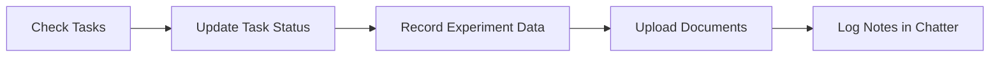
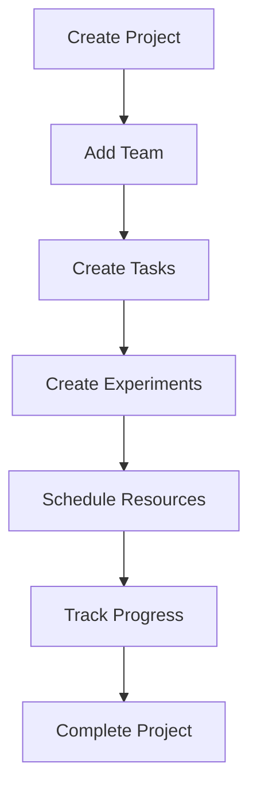
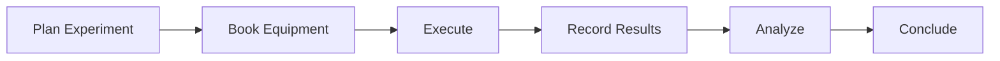

# Quick Start Guide

Get up and running with Scientific Project Manager in 10 minutes!

## Step 1: Access the Module

After installation, find **Scientific Project** in the Odoo main menu.

```
Main Menu → Scientific Project
```

You'll see the following submenus:
- Projects
- Tasks
- Experiments
- Researchers
- Documents
- Equipment
- Reagents
- Schedule

## Step 2: Create Your First Researcher

Before creating projects, add at least one researcher who will be the Principal Investigator.

1. Click **Scientific Project → Researchers**
2. Click **Create**
3. Fill in the form:

```yaml
Name: Dr. Jane Smith
Email: jane.smith@university.edu
Phone: +1-555-0123
Type: Professor
Title: Ph.D.
Affiliation: University of Science - Biology Dept
Specialization: Molecular Biology
```

4. Click **Save**

!!! tip "Automatic User Creation"
    The system automatically creates an Odoo user account for each researcher!

## Step 3: Create Your First Project

Now let's create a research project.

1. Navigate to **Scientific Project → Projects**
2. Click **Create**
3. Fill in the project details:

```yaml
Name: Cancer Biomarker Discovery
Start Date: 2025-01-01
End Date: 2026-12-31
Status: Draft
Principal Investigator: Dr. Jane Smith
Description: |
  Research project to identify novel cancer biomarkers
  for early detection and treatment monitoring.
```

4. Click **Save**

### Add Collaborators

In the same form:

1. Go to **Collaborators** field
2. Click to add more researchers
3. Select team members

### Change Status

Click the status buttons at the top to change project state:

```
[Draft] → [In Progress] → [Done] → [Cancelled]
```

## Step 4: Create an Experiment

Let's add an experiment to the project.

1. Go to **Scientific Project → Experiments**
2. Click **Create**
3. Fill in basic information:

```yaml
Name: Cell Viability Assay - Drug X
Project: Cancer Biomarker Discovery
Status: Planning
Start Date: 2025-02-01
End Date: 2025-02-28
Assigned To: Dr. Jane Smith
```

### Document the Scientific Method

Fill in each tab:

**Introduction Tab:**
```
Background: Current cancer treatments have limitations...
Research Context: Previous studies have shown...
```

**Hypothesis Tab:**
```
Drug X will reduce cell viability of cancer cells
by >50% at 10μM concentration within 48 hours.
```

**Methodology Tab:**
```
Materials:
- MCF-7 cell line
- Drug X (various concentrations)
- MTT assay kit

Procedure:
1. Seed cells at 10,000 cells/well
2. Treat with Drug X
3. Incubate for 48 hours
4. Perform MTT assay
5. Measure absorbance
```

4. Click **Save**

## Step 5: Register Equipment

Add laboratory equipment to track usage and maintenance.

1. Navigate to **Scientific Project → Equipment**
2. Click **Create**
3. Enter equipment details:

```yaml
Name: Microplate Reader - BioTek Epoch 2
Type: Spectrophotometer
Location: Lab 3A, Bench 5
Status: Available
Maintenance Schedule: 2025-06-01
Care Taker: Dr. Jane Smith
```

4. Click **Save**

## Step 6: Schedule Equipment

Book equipment for your experiment.

1. Go to **Scientific Project → Schedule**
2. Switch to **Calendar View**
3. Click on a time slot
4. Fill in booking details:

```yaml
Equipment: Microplate Reader - BioTek Epoch 2
Researcher: Dr. Jane Smith
Experiment: Cell Viability Assay - Drug X
Start Time: 2025-02-01 09:00
End Time: 2025-02-01 17:00
```

5. Click **Save**

### View Schedule

The calendar view shows all equipment bookings. Use it to:
- See equipment availability
- Prevent double-booking
- Plan resource usage

## Step 7: Create Tasks

Break down work into actionable tasks.

1. Navigate to **Scientific Project → Tasks**
2. Click **Create**
3. Create tasks for your project:

```yaml
Task 1:
  Name: Literature Review - Cancer Biomarkers
  Project: Cancer Biomarker Discovery
  Assigned To: Dr. Jane Smith
  Start Date: 2025-01-15
  End Date: 2025-02-15
  Status: Planning

Task 2:
  Name: Order Reagents and Materials
  Project: Cancer Biomarker Discovery
  Assigned To: Lab Manager
  Start Date: 2025-01-20
  End Date: 2025-01-25
  Status: Planning
```

### Switch to Kanban View

1. Click the Kanban view icon
2. See tasks organized by status columns
3. Drag tasks between columns to update status

## Step 8: Upload Documents

Attach relevant documentation to your project.

1. Go to **Scientific Project → Documents**
2. Click **Create**
3. Upload a document:

```yaml
Title: Research Proposal - Cancer Biomarker Study
Type: Proposal
Status: Draft
Confidentiality Level: Internal
File: [Upload PDF]
Authors: Dr. Jane Smith
```

4. Link to your project in the **Projects** field
5. Click **Save**

## Step 9: Use the Chatter

For projects and tasks, use the built-in chatter for communication.

In any project or task form:

1. Scroll to the bottom
2. **Log note**: Internal notes (not sent to followers)
3. **Send message**: Notifications to all followers
4. **Schedule Activity**: Create reminders and tasks

Example:
```
Log note: "Completed literature review.
Found 15 relevant papers on biomarker discovery."
```

## Step 10: Track Progress

### View Project in Kanban

1. Go to **Projects**
2. Switch to **Kanban View**
3. See all projects organized by status
4. Drag projects between columns

### View Timeline in Calendar

1. Switch to **Calendar View**
2. See all projects on a timeline
3. Identify overlaps and conflicts

### Monitor Equipment Usage

1. Go to **Schedule**
2. Switch to **Calendar View**
3. See weekly equipment bookings

## Common Workflows

### Daily Workflow for Researchers



### Project Management Workflow



### Experiment Workflow



## Tips for Success

!!! tip "Use Tags"
    Tag researchers by department, skill, or project type for easy filtering.

!!! tip "Status Updates"
    Keep project and task statuses current for accurate reporting.

!!! tip "Document Everything"
    Upload protocols, data files, and results as documents for complete records.

!!! tip "Calendar View"
    Use calendar views to visualize timelines and prevent conflicts.

!!! tip "Chatter Communication"
    Use chatter instead of external emails to keep all communication in context.

## What's Next?

Now that you've created your first project, explore more features:

- [Projects Documentation](../user-guide/core-modules/projects.md) - Deep dive into project management
- [Experiments Guide](../user-guide/core-modules/experiments.md) - Full scientific method workflow
- [Workflows](../user-guide/workflows.md) - Standard operating procedures
- [Best Practices](../user-guide/best-practices.md) - Tips from experienced users

## Need Help?

- [User Guide](../user-guide/overview.md) - Comprehensive feature documentation
- [FAQ](../faq.md) - Frequently asked questions
- [Troubleshooting](../troubleshooting.md) - Common issues and solutions

Congratulations! You're now ready to manage your scientific projects effectively! 🎉
