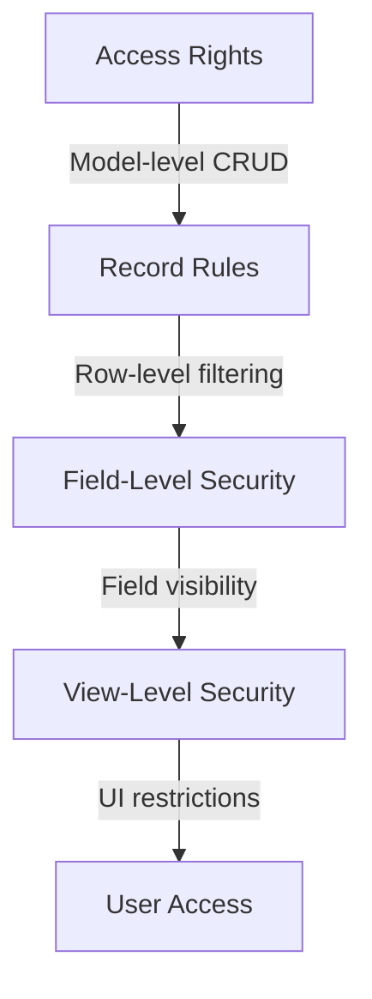
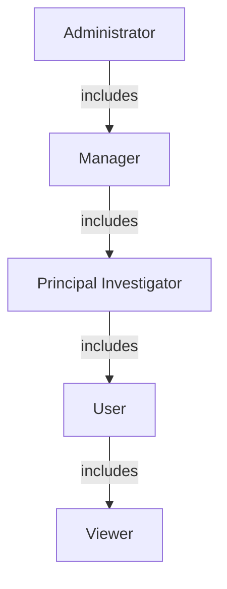

# Security Overview

Security configuration is critical for protecting your research data. This guide covers the security architecture of the Scientific Project Manager addon.

## Current Security Status

!!! warning "Default Configuration"
    The module ships with **open access** - all authenticated users have full CRUD permissions on all models. This is suitable for development and testing only.

!!! danger "Production Warning"
    Before deploying to production, you **must** implement proper security groups and access controls!

## Security Layers

Odoo provides four layers of security:



### 1. Access Rights (CRUD)

Model-level permissions: Create, Read, Update, Delete

**Current Configuration**:
```csv
Model                    | Read | Write | Create | Delete | Group
scientific.project       | ✅   | ✅    | ✅     | ✅     | None
scientific.task          | ✅   | ✅    | ✅     | ✅     | None
scientific.experiment    | ✅   | ✅    | ✅     | ✅     | None
(all models...)          | ✅   | ✅    | ✅     | ✅     | None
```

### 2. Record Rules

Row-level security to filter which specific records a user can access.

**Not Currently Implemented**

### 3. Field-Level Security

Restrict visibility of specific fields based on user groups.

**Not Currently Implemented**

### 4. View-Level Security

Hide UI elements (buttons, tabs, fields) based on groups.

**Not Currently Implemented**

## Recommended Security Groups

### Proposed Architecture



### Group Definitions

| Group | Description | Permissions |
|-------|-------------|-------------|
| **Manager** | Lab managers, directors | Full access to all features |
| **Principal Investigator** | Project leads | Manage own projects, create experiments |
| **User** | Researchers, lab members | View projects, update assigned tasks/experiments |
| **Viewer** | Students, observers | Read-only access to public data |

## Implementation Guide

### Quick Start

1. **Review Current State**
   - [Current Configuration](current-configuration.md)

2. **Plan Security Groups**
   - [Security Groups](security-groups.md)
   - Decide who needs what access

3. **Implement Record Rules**
   - [Record Rules](record-rules.md)
   - Control data visibility

4. **Deploy and Test**
   - [Implementation Guide](implementation-guide.md)
   - Test each group thoroughly

5. **Follow Best Practices**
   - [Best Practices](best-practices.md)
   - Ongoing security management

## Quick Implementation

For a production-ready security setup:

### Step 1: Create Security Groups

Create `security/security_groups.xml`:

```xml
<?xml version="1.0" encoding="utf-8"?>
<odoo>
    <data>
        <record id="module_category_scientific_project" model="ir.module.category">
            <field name="name">Scientific Project</field>
        </record>

        <record id="group_scientific_project_manager" model="res.groups">
            <field name="name">Manager</field>
            <field name="category_id" ref="module_category_scientific_project"/>
        </record>

        <!-- Add other groups... -->
    </data>
</odoo>
```

### Step 2: Update Access Rights

Modify `security/ir.model.access.csv` to restrict by group:

```csv
id,name,model_id:id,group_id:id,perm_read,perm_write,perm_create,perm_unlink
access_scientific_project_manager,project.manager,model_scientific_project,group_scientific_project_manager,1,1,1,1
access_scientific_project_user,project.user,model_scientific_project,group_scientific_project_user,1,0,0,0
```

### Step 3: Add Record Rules

Create `security/record_rules.xml`:

```xml
<record id="rule_project_user" model="ir.rule">
    <field name="name">User sees assigned projects</field>
    <field name="model_id" ref="model_scientific_project"/>
    <field name="groups" eval="[(4, ref('group_scientific_project_user'))]"/>
    <field name="domain_force">[('collaborators_ids.user_id', 'in', [user.id])]</field>
</record>
```

### Step 4: Update Manifest

```python
'data': [
    'security/security_groups.xml',     # FIRST
    'security/ir.model.access.csv',     # SECOND
    'security/record_rules.xml',        # THIRD
    # ... view files
],
```

### Step 5: Install and Assign Users

1. Upgrade module
2. Assign users to groups
3. Test each group's access

## Security Checklist

### Pre-Production

- [ ] Security groups defined
- [ ] Access rights configured
- [ ] Record rules implemented
- [ ] Field-level security applied
- [ ] All users assigned to groups
- [ ] Each group tested
- [ ] Sensitive data protected
- [ ] Audit logging enabled

### Production

- [ ] HTTPS enabled
- [ ] Strong password policy
- [ ] Two-factor authentication for admins
- [ ] Regular security audits
- [ ] Access reviews quarterly
- [ ] Backup and recovery tested
- [ ] Incident response plan documented

## Common Scenarios

### Scenario 1: Multi-Department Lab

**Requirements**:
- Each department sees only their projects
- Lab manager sees everything

**Solution**:
- Add department field to projects
- Record rule: Filter by department
- Manager group bypasses rule

### Scenario 2: Confidential Research

**Requirements**:
- Confidential projects visible only to PI and team
- Public projects visible to all

**Solution**:
- Add confidentiality field
- Record rules based on:
  - Confidentiality level
  - Team membership
  - User group

### Scenario 3: External Collaborators

**Requirements**:
- External users see specific projects only
- No access to equipment or reagents

**Solution**:
- Portal user group
- Record rule: Filter by collaboration
- Remove equipment/reagent access rights

## Compliance Considerations

### GDPR (General Data Protection Regulation)

Researcher personal data requires:
- Data minimization
- Right to access
- Right to erasure
- Data portability

See [Compliance Guide](compliance.md) for details.

### HIPAA (Health Insurance Portability and Accountability Act)

For health data:
- Encryption at rest and in transit
- Audit trails for all access
- Automatic logoff
- Emergency access procedures

**Note**: Additional modules required for full HIPAA compliance.

### ISO 27001

Information security management:
- Access control policy
- Regular access reviews
- Security incident management
- Business continuity

## Resources

### Documentation

- [Current Configuration](current-configuration.md) - Analysis of default settings
- [Security Groups](security-groups.md) - Detailed group definitions
- [Record Rules](record-rules.md) - Row-level security
- [Implementation Guide](implementation-guide.md) - Step-by-step setup
- [Best Practices](best-practices.md) - Ongoing security management
- [Troubleshooting](troubleshooting.md) - Common security issues

### Tools

- Odoo Security Audit Module
- Access Rights Matrix Generator
- Record Rule Tester

### External Resources

- [Odoo Security Documentation](https://www.odoo.com/documentation/15.0/developer/reference/backend/security.html)
- [OWASP Top 10](https://owasp.org/www-project-top-ten/)
- [NIST Cybersecurity Framework](https://www.nist.gov/cyberframework)

## Getting Help

For security questions:

- Review this documentation
- Check [Troubleshooting](troubleshooting.md)
- Open GitHub issue (for non-sensitive questions)
- Contact security team (for sensitive issues)

!!! danger "Security Issues"
    For security vulnerabilities, please contact us privately rather than opening a public issue.

---

**Next Steps**: Review [Current Configuration](current-configuration.md) to understand default settings, then follow the [Implementation Guide](implementation-guide.md) to secure your installation.

For complete security documentation, see [SECURITY.md](https://github.com/steven0seagal/odoo_scientific_project/blob/main/odoo/addons/scientific_project/SECURITY.md) in the repository.
